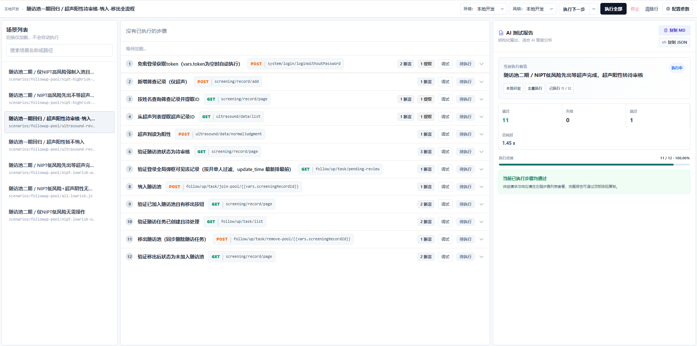
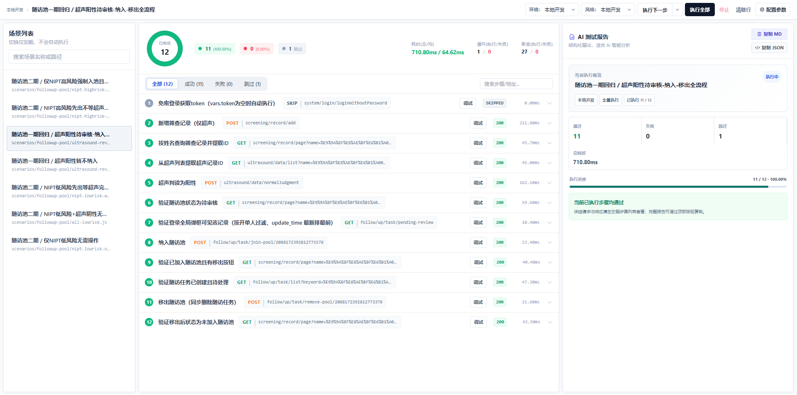
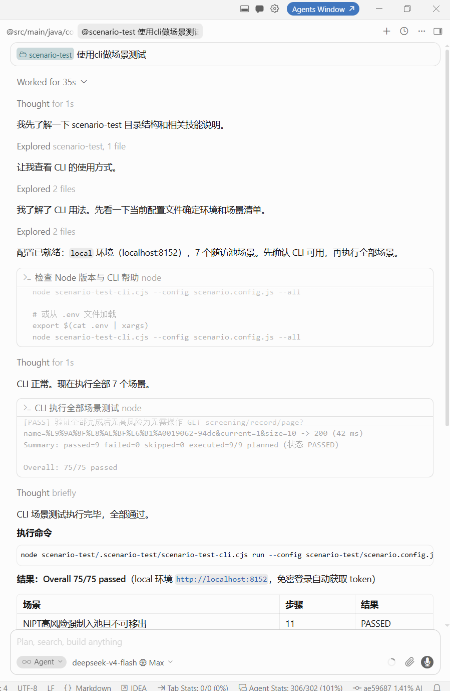

# scenario-test

为 AI 协作打造的 HTTP 场景测试工具：开发者只需告诉 AI 要测试的业务功能，就能自动生成并维护接口测试场景；免 npm 安装、不侵入业务项目，浏览器工作台与命令行共享同一套场景，开箱即测。

`scenario-test` 是面向业务项目的 HTTP 场景测试工具，提供统一 DSL、浏览器工作台和 Node.js CLI。默认采用免 npm 接入，不修改业务项目依赖，也不要求克隆本仓库。

## 快速接入

要求：Node.js 18+。

在**业务项目根目录**打开 AI 助手，复制下面这段 AI 接入 Prompt：

```text
请在当前项目根目录接入 @yc_yzkj/scenario-test。目标目录为 scenario-test。

执行要求：
1. 先确认当前目录是项目根目录，且 Node.js 版本不低于 18；不满足时停止并说明原因。
2. 不克隆公共库源码，不修改业务代码、构建配置或已有场景文件；不启动服务、不调用业务接口、不写入 Token、Secret 或真实测试数据。
3. 默认免 npm 安装：直接执行官方固定版本脚本（Windows: irm https://cdn.jsdelivr.net/gh/youzhikeji/scenario-test@v0.5.20/scripts/install.ps1 | iex；macOS/Linux: curl -fsSL https://cdn.jsdelivr.net/gh/youzhikeji/scenario-test@v0.5.20/scripts/install.sh | bash -s -- . scenario-test）。只有用户明确要求使用 npm 时，才改用 npm install -D @yc_yzkj/scenario-test 并执行 npx @yc_yzkj/scenario-test init --project . --dir "scenario-test"。
4. 运行 doctor 体检确认安装完整（免 npm: node scenario-test/.scenario-test/scenario-test-cli.cjs doctor --config scenario-test/scenario.config.js；npm: npx @yc_yzkj/scenario-test doctor --config scenario-test/scenario.config.js）。有 FAIL 时停止并报告，不继续后续步骤。
5. doctor 通过后，读取刚生成的 scenario-test/.scenario-test/AI_SCENARIO_PROMPT.md 作为后续场景设计规则，不要要求用户复制或粘贴。
6. 然后只询问：“你要测试哪个业务功能？请提供功能名称，以及页面、Controller、接口或已有测试中的任一入口。”此时不要扫描整个项目或生成场景。

任一环节失败时停止并报告具体原因，不静默切换安装方式。
```

安装成功后，AI 会直接读取项目内规则，用户不需要再次复制。新会话可直接输入：

```text
请读取 scenario-test/.scenario-test/AI_SCENARIO_PROMPT.md，为“<业务功能名称>”设计场景测试。入口：<页面、Controller、接口或已有测试路径>。
```

### 不使用 AI

默认免 npm，不修改 `package.json` 或 `package-lock.json`：

```powershell
# Windows PowerShell
irm https://cdn.jsdelivr.net/gh/youzhikeji/scenario-test@v0.5.20/scripts/install.ps1 | iex
```

```bash
# macOS / Linux
curl -fsSL https://cdn.jsdelivr.net/gh/youzhikeji/scenario-test@v0.5.20/scripts/install.sh | bash -s -- . scenario-test
```

默认情况下，安装脚本只从 npm Registry 下载一次固定版本 tarball，在临时目录解压后从本地 `dist/` 初始化；不会执行 `npm install`、访问 GitHub API 或修改业务项目依赖。脚本会把 CLI、浏览器运行时、类型声明、能力清单和版本锁写入 `scenario-test/.scenario-test/`，并自动执行 doctor。内网下载源的指定方式：PowerShell 使用 `-Source <目录>`；macOS/Linux 使用第三个位置参数或 `SCENARIO_TEST_SOURCE`。内网目录需要包含完整的 `dist` 运行时文件。

### 安装完成后

1. 告诉 AI 要测试的一个业务功能，并提供页面、Controller、接口或已有测试入口。
2. AI 维护 `scenario.config.js` 和 `scenarios/`，但不会实际调用业务接口。
3. 双击 `scenario-test/start-scenario-test.cmd` 启动工作台。
4. 工作台通过本地 `serve` 代理访问所选环境，无需后端额外放行 CORS。

每次只处理一个业务功能，不要扫描整个项目批量生成。

> 已接入的项目升级到新版本，见文末 [升级](#升级) 章节。

## 可选：npm 接入

npm 适合 CI、公共库开发或偏好包管理的团队，不是默认业务接入方式。

```powershell
npm install -D @yc_yzkj/scenario-test
npx @yc_yzkj/scenario-test init --project . --dir "scenario-test"
npx @yc_yzkj/scenario-test doctor --config scenario-test/scenario.config.js
```

安装脚本也支持显式 npm 模式：

- Windows：本地执行 `install.ps1 -UseNpm`。
- macOS/Linux：设置 `SCENARIO_TEST_USE_NPM=true` 后执行 `install.sh`。

npm 与免 npm 最终生成相同的项目运行时副本；两种方式不混用，失败后不自动切换。

## 常用操作

### 启动浏览器工作台

推荐双击：

```text
scenario-test/start-scenario-test.cmd
```

也可以手动执行：

```powershell
node .\scenario-test\.scenario-test\scenario-test-cli.cjs serve `
  --config .\scenario-test\scenario.config.js `
  --port 4300
```

> 手动指定 `--port` 默认 4300；双击 `start-scenario-test.cmd` 时脚本会向系统申请随机空闲端口，多项目同时启动互不冲突。

### 执行场景

```powershell
# 全部非 manual 场景（命令 run 紧跟脚本名）
node .\scenario-test\.scenario-test\scenario-test-cli.cjs run `
  --config .\scenario-test\scenario.config.js --env local --all

# 指定场景
node .\scenario-test\.scenario-test\scenario-test-cli.cjs run `
  --config .\scenario-test\scenario.config.js --env local --scenario <场景ID>
```

### 体检

```powershell
node .\scenario-test\.scenario-test\scenario-test-cli.cjs doctor `
  --config .\scenario-test\scenario.config.js
```

## 使用示例

浏览器工作台支持查看场景列表、逐步执行接口请求，并实时展示执行进度与结果。



场景执行完成后，工作台会汇总成功、失败和跳过的步骤，并展示耗时与执行详情。



也可以让 AI 根据项目中的接口和业务信息设计场景，并通过 CLI 执行场景测试、汇总测试结果。



### 自定义下载源

`init` 的 `--library-url <目录>` 指向包含以下文件的目录（6 个，缺任一则对应副本缺失）：

- `scenario-test-cli.cjs`
- `scenario-test.umd.js`
- `scenario-test.d.ts`
- `scenario-test-capabilities.json`
- `AI_SCENARIO_PROMPT.md`
- `SCENARIO_PATTERNS.md`

## 项目目录

```text
scenario-test/
├─ .scenario-test/                 # AI 规则与固定版本运行时副本（init 生成）
├─ scenarios/                      # 按业务功能组织的场景（由 AI 维护，非 init 生成）
├─ plugins/                        # 可选：项目专属 Node 插件（按需创建）
├─ scenario.config.js              # 环境、变量和场景清单（init 生成骨架）
├─ index.html                      # 浏览器工作台入口（init 生成）
└─ start-scenario-test.cmd         # Windows 双击启动入口（init 生成）
```

初始化配置使用项目内类型声明，npm 与免 npm 均可获得提示：

```js
/// <reference path="./.scenario-test/scenario-test.d.ts" />
```

## 核心能力

- 声明式 HTTP 场景 DSL，支持变量、提取、断言、条件和重试。
- 浏览器工作台与 Node.js CLI 使用同一套场景。
- `serve` 提供静态服务和同源接口代理。
- `doctor` 校验配置、场景、运行时版本和 SHA256 指纹。
- `capabilities --json` 输出机器可读能力清单。
- `manual: true` 场景默认不参与 `--all`。
- 支持 `--fail-on-skip`、文件上传、响应保存及自定义 Node 插件。

完整示例见 [`examples/complete`](examples/complete)，DSL 能力以 `src/contract.js` 和 `scenario-test-capabilities.json` 为准。

## 安全

- 场景文件是可执行代码，只加载可信来源。
- 不要提交生产凭据、个人数据或真实 Token。
- CLI/CI 优先通过环境变量提供敏感值。
- 浏览器本地存储适合受控联调环境，不应保存生产凭据。

详细说明见 [SECURITY.md](SECURITY.md)。

## 升级

已接入的项目升级到新版本，重跑一次接入脚本即可。安装脚本是幂等的：`init` 读取 `.scenario-test/.scenario-test-version.json` 版本锁，锁内版本与新版不一致时自动刷新运行时副本并重写版本锁；AI 规则与模式库每次 `init` 都会刷新。**默认保留你现有的 `scenario.config.js` 和 `scenarios/` 场景文件，不要传 `--force`（那会覆盖它们）。**

### 判断接入方式

- 项目里有 `scenario-test/.scenario-test/` 目录 → 免 npm 接入
- `package.json` 里有 `@yc_yzkj/scenario-test` 依赖 → npm 接入

### 免 npm 升级

在业务项目根目录执行（版本号换成目标版本，当前 `v0.5.20`）：

```powershell
# Windows PowerShell
irm https://cdn.jsdelivr.net/gh/youzhikeji/scenario-test@v0.5.20/scripts/install.ps1 | iex
```

```bash
# macOS / Linux
curl -fsSL https://cdn.jsdelivr.net/gh/youzhikeji/scenario-test@v0.5.20/scripts/install.sh | bash -s -- . scenario-test
```

### npm 升级

```powershell
npm install -D @yc_yzkj/scenario-test@0.5.20
npx @yc_yzkj/scenario-test init --project . --dir "scenario-test"
```

### 内网升级（无外网）

通过 `-Source` 指向内网运行时目录（需包含完整 `dist` 的 4 个运行时文件）：

```powershell
.\install.ps1 -Source "https://gitlab.example.com/group/project/-/raw/v0.5.20/dist"
```

### 升级后体检

```powershell
node .\scenario-test\.scenario-test\scenario-test-cli.cjs doctor --config .\scenario-test\scenario.config.js
```

`doctor` 全部 PASS（尤其 version-lock、capabilities 版本一致）即升级成功。

历史变更见 [CHANGELOG.md](CHANGELOG.md)。

## 维护者

```powershell
npm install
npm run build
npm test
npm run test:browser
```

发布流程见 [docs/RELEASING.md](docs/RELEASING.md)。
